# Secure Internal App Delivery Platform on Azure

A secure internal application delivery platform built on Microsoft Azure using **Terraform**, **AKS**, **ACR**, **Azure Arc**, **Flux GitOps**, **Azure Key Vault**, **Workload Identity**, and **Cluster Autoscaler**.

## Project Overview

This project demonstrates how to build a secure and scalable internal application platform on Azure instead of relying on manual deployment steps, static credentials, and inconsistent infrastructure configuration.

The platform was designed to solve common internal delivery challenges such as:

- manual deployments
- weak secrets handling
- limited scalability
- no GitOps-based deployment flow
- limited hybrid-readiness

## Business Problem

Many internal applications are still deployed using manual infrastructure provisioning, direct cluster changes, and secrets stored in files or manifests.

This creates issues such as:

- inconsistent deployment workflows
- poor auditability
- difficult rollback and change tracking
- insecure secret management
- weak scaling and governance controls

## Solution

This project addresses those challenges by implementing:

- **Terraform** for infrastructure provisioning
- **Azure Kubernetes Service (AKS)** for container orchestration
- **Azure Container Registry (ACR)** for private container image storage
- **Flux GitOps** for Git-driven deployment
- **Azure Key Vault** for centralized secrets storage
- **Microsoft Entra Workload Identity** for secretless pod authentication
- **Secrets Store CSI Driver** for mounting Key Vault secrets into pods
- **Cluster Autoscaler** for automatic node scaling
- **Azure Arc-enabled Kubernetes** for hybrid-ready cluster management

## Architecture Diagram

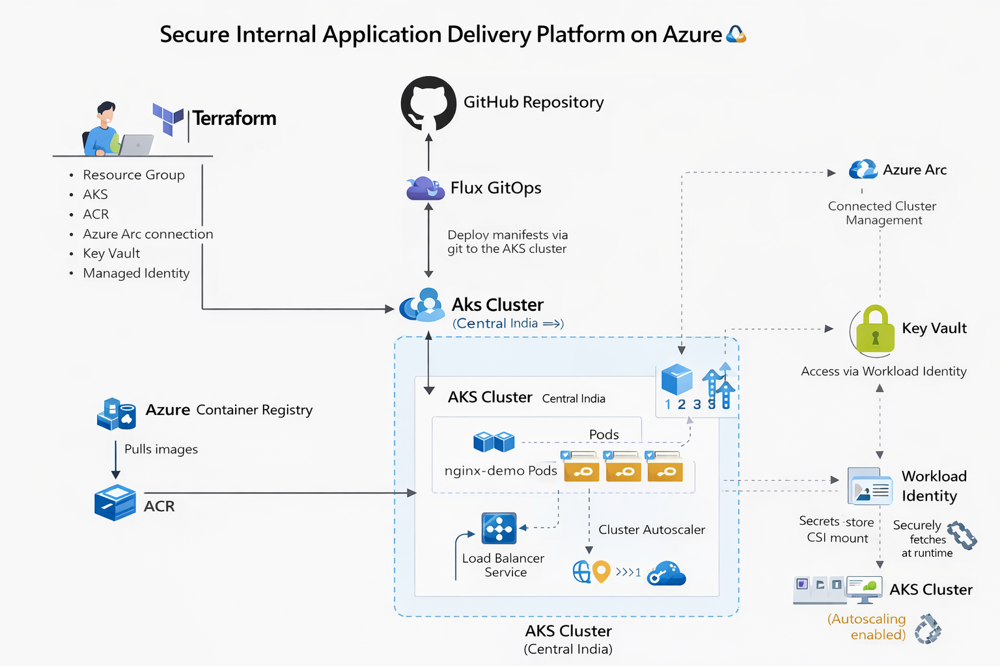

## Core Features

- Infrastructure as Code with Terraform
- AKS-based workload hosting
- Private image delivery with ACR
- GitOps deployment using Flux and GitHub
- Centralized secrets management with Azure Key Vault
- Secretless pod authentication using Workload Identity
- CSI-based secret mounting into workloads
- Cluster autoscaling for node capacity management
- Azure Arc integration for hybrid-ready operations

## Repository Structure

```text
.
├── .gitignore
├── README.md
├── acr.tf
├── main.tf
├── outputs.tf
├── providers.tf
├── terraform.tfvars.example
├── variables.tf
├── gitops/
│   ├── apps/
│   ├── clusters/
│   └── infrastructure/
├── diagrams/
│   └── 22-secure-internal-app-delivery-platform-architecture-diagram.png
└── screenshots/
```

## Architecture Components

### Terraform
Terraform provisions the core Azure infrastructure and defines the platform foundation as code.

### AKS
AKS hosts the application workloads and provides managed Kubernetes orchestration.

### ACR
ACR stores private application images and allows AKS to pull them securely.

### Azure Arc
The AKS cluster was connected to Azure Arc to demonstrate hybrid-ready cluster management and extension support.

### Flux GitOps
Flux continuously reconciles the cluster state from the GitHub repository, making Git the source of truth.

### Key Vault + Workload Identity
Secrets are stored in Azure Key Vault and accessed from workloads through Microsoft Entra Workload Identity and Secrets Store CSI Driver.

## Deployment Flow

1. Terraform provisions the Azure resources.
2. AKS hosts the application workloads.
3. ACR stores the container image.
4. GitHub stores the Kubernetes manifests.
5. Flux watches the GitHub repository.
6. Flux applies changes automatically to the AKS cluster.
7. Secrets are retrieved from Azure Key Vault through Workload Identity.

## GitOps Flow

1. Infrastructure is created with Terraform.
2. Application manifests are stored in GitHub.
3. Flux monitors the repository.
4. Any approved change pushed to GitHub is reconciled automatically into the cluster.
5. Application scaling and deployment changes are handled through Git instead of direct kubectl edits.

## Secrets Management Flow

1. A secret is stored in Azure Key Vault.
2. A user-assigned managed identity is created.
3. A federated credential links the AKS ServiceAccount to that identity.
4. The pod authenticates using Workload Identity.
5. The secret is mounted into the pod using Secrets Store CSI Driver.

## Validation Performed

The following items were validated during implementation:

- AKS cluster deployment
- node pool configuration
- cluster autoscaler enablement
- ACR image import and image pull from AKS
- Azure Arc cluster connection
- Flux GitOps synchronization from GitHub
- GitOps-based scaling update
- Key Vault secret retrieval from inside a pod
- Workload Identity and federated credential integration
- application exposure through LoadBalancer and browser access

## Screenshots

### Azure Resources
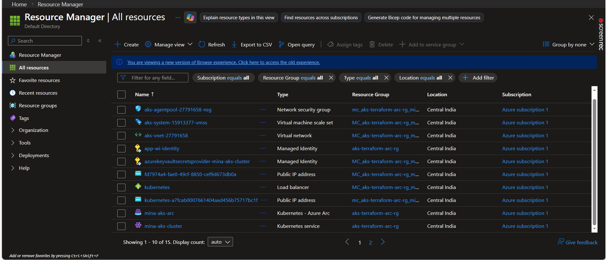
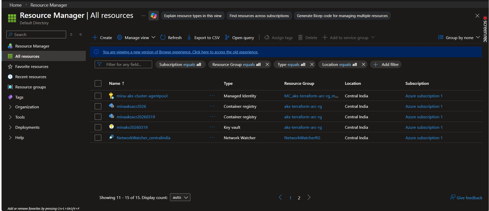

### AKS
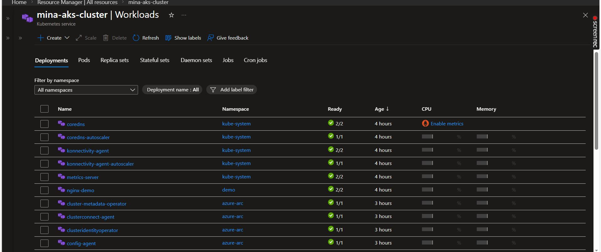
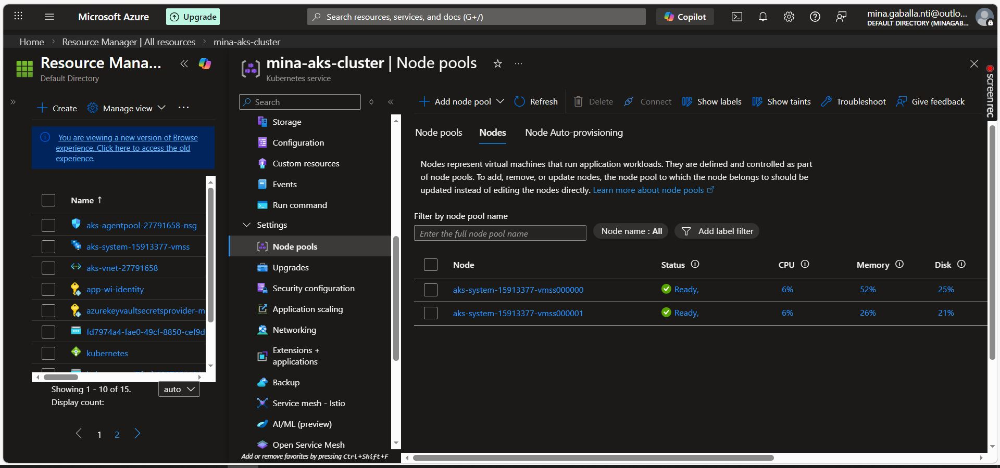
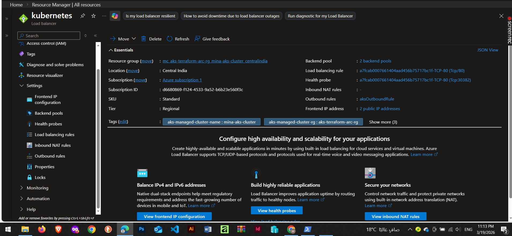
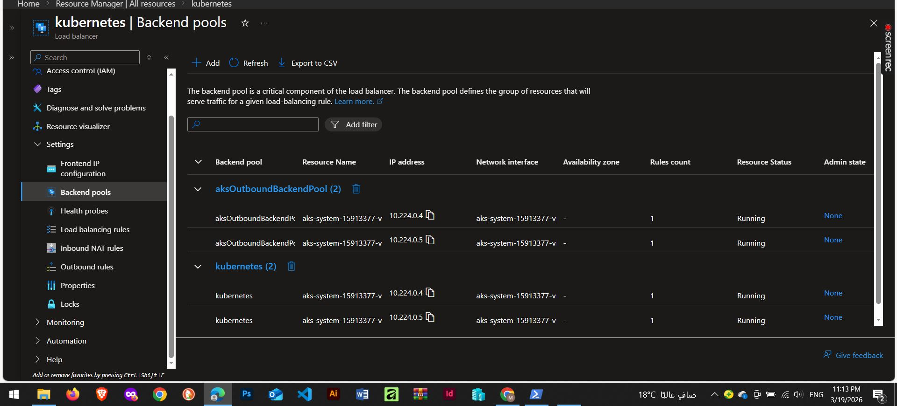
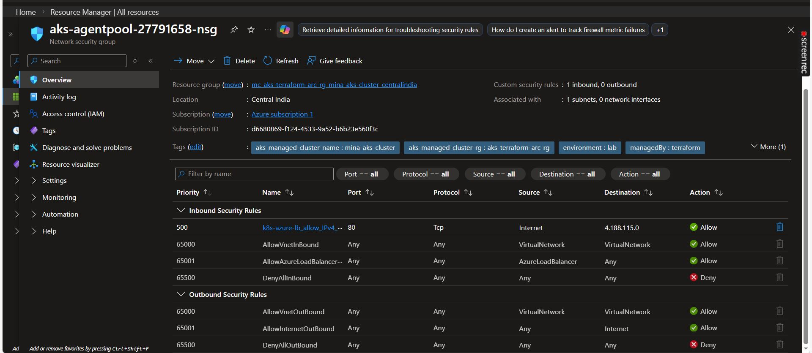
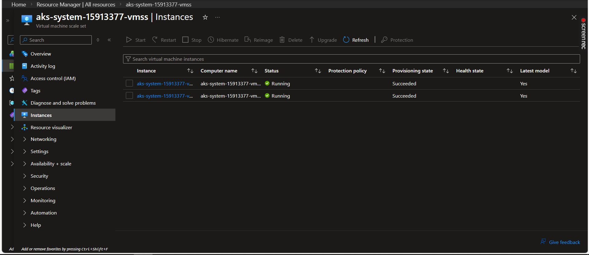

### ACR
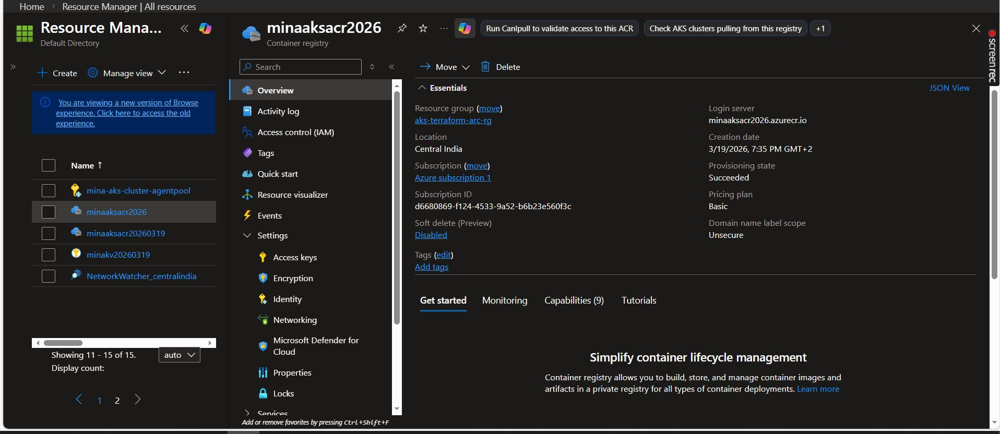
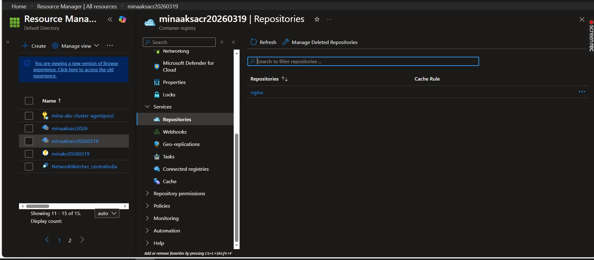

### GitOps and Flux
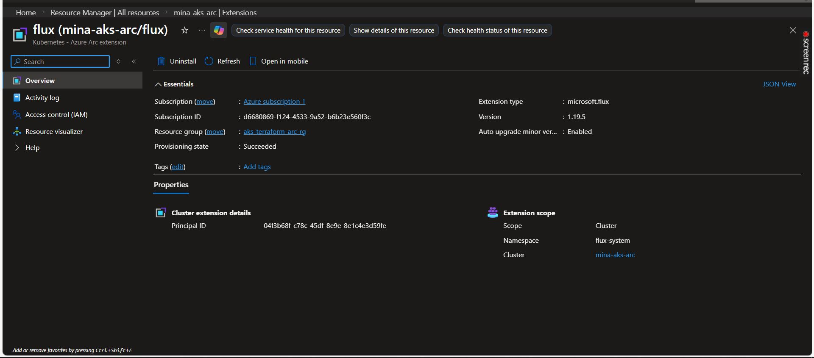
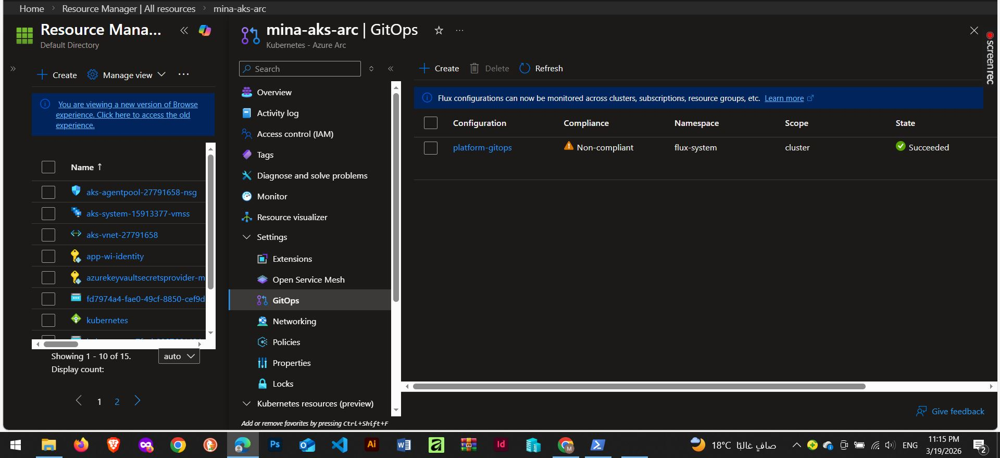
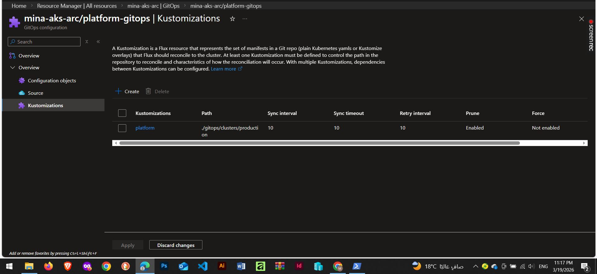
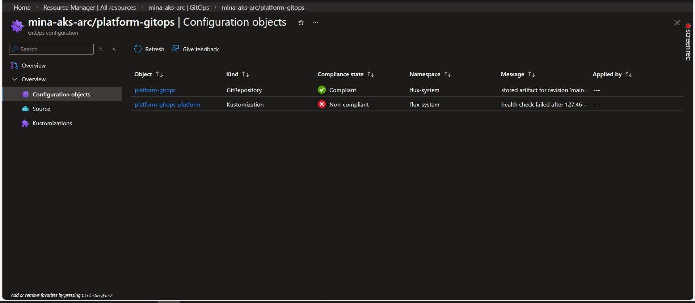

### Identity and Secrets
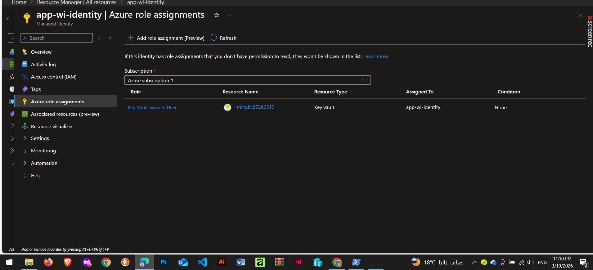
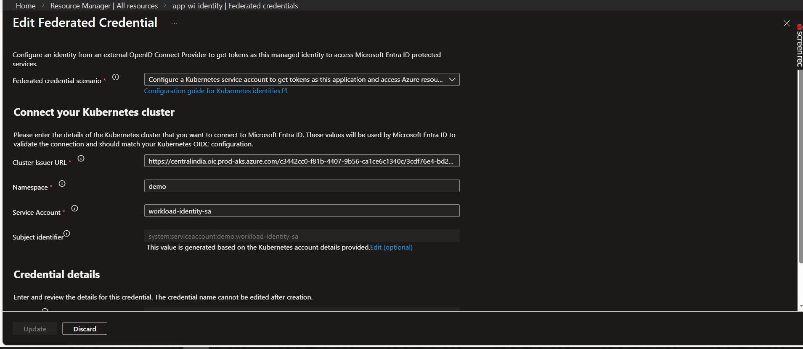

### Application Validation
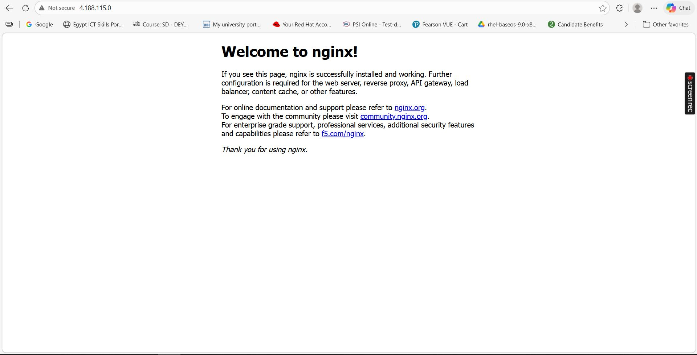

## Project Status

The Azure resource group used for validation was intentionally deleted after testing to avoid ongoing cloud costs.

This repository remains as a documented implementation of the project, including:

- Terraform code
- GitOps manifests
- architecture diagram
- screenshots
- implementation proof

## Important Security Note

Sensitive values should not be stored in Git.

This project uses Azure Key Vault, Workload Identity, and Secrets Store CSI Driver to avoid storing secrets directly in source control or Kubernetes manifests.

Any screenshot that contains sensitive runtime values should be reviewed or sanitized before publishing.

## Future Improvements

Possible next enhancements include:

- Azure Monitor
- Managed Prometheus and Grafana
- Azure Policy
- Defender for Containers
- KEDA
- additional external cluster connected through Azure Arc

## Outcome

This project demonstrates a practical platform engineering use case and not just a basic infrastructure lab.

It delivers:

- Infrastructure as Code
- Secure software delivery
- Centralized secrets management
- GitOps deployment
- Autoscaling
- Hybrid-ready operations

## Author

**Mina Gaballa**
